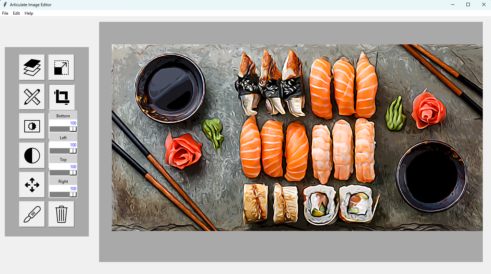

# 🖼️ Articulate-Image-Editor
A simple GUI-based image editor built with **Python** and **Tkinter**, supporting basic image manipulation features like resizing, cropping, slicing, adjusting contrast, saturation, brightness, and applying blur effects.

---

## ✨ Features

- 📏 Resize images
- ✂️ Crop regions
- 🍰 Slice images into parts
- 🌈 Adjust saturation
- 🔆 Control brightness
- 🎚️ Tune contrast
- 💨 Apply blur effects

All through a user-friendly interface powered by Tkinter.

---

## 🚀 Getting Started

### 📦 Prerequisites

- Python 3.7+
- Install dependencies:

```bash
pip install -r requirements.txt
```

> Commonly used libraries include: `Pillow`, `OpenCV (cv2)`, `NumPy`, `Tkinter` (built-in with Python)

---

### 📁 Installation & Running

1. **Clone the repository:**

```bash
git clone https://github.com/ben-gunnels/Articulate-Image-Editor.git
cd image-editor/modules/
```

2. **Run the application:**

```bash
python -m app.src.app
```

---

## 🛠️ Project Structure

```
articulate-image-editor/
├── modules/
│   ├── app/
│   │   ├── __pycache__/
│   │   ├── src/
│   │   │   ├── __init__.py
│   │   │   ├── app.py          # Main application entry
│   │   │   └── Globals.py      # Shared global variables
│   ├── core/
│   │   ├── perf/
│   │   └── src/
│   │       ├── __init__.py
│   │       ├── utils/                 # Utility scripts
│   │       ├── articulate_image.py    # Image object abstraction
│   │       ├── color_augmentation.py  # Saturation, contrast, brightness
│   │       ├── draggable_label.py     # UI label with drag
│   │       ├── file_manager.py        # File loading/saving
│   │       ├── image_scalpel.py       # Image slicing logic
│   │       ├── layers_manager.py      # Layer control logic
│   │       ├── layers.py              # Image layer definitions
│   │       ├── reorient.py            # Rotation, flipping, etc.
│   │       ├── resize.py              # Image resizing logic
│   │       └── Widget.py              # Base widget class
│   ├── gui/
│   │   ├── __pycache__/
│   │   └── src/
│   │       ├── __init__.py
│   │       ├── articulate_frame.py    # Tkinter frame logic
│   │       ├── config.py              # GUI configuration
│   │       ├── gui_objects.py         # Tkinter UI components
│   │       ├── gui.py                 # GUI window setup
│   │       └── widgets.py             # Custom widgets
│   ├── test/
│   └── utils.py
├── assets/                     # Sample images/icons
└── README.md
```

---

## 🖼️ Screenshot



---

## 📄 License

MIT License © 2025 Benjamin Gunnels

---

## 🤝 Contributions

Contributions, issues and feature requests are welcome!  
Feel free to submit a pull request or open an issue.

---
